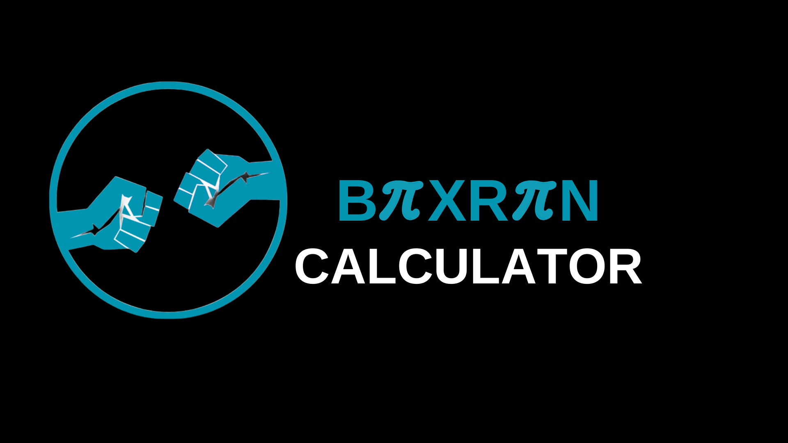

# BaxrenCalculatorCLI
Lokal olarak çalışan açık kaynak, özgür yazılım olan gelişmiş bir hesap makinesi.

**BİR [BAXREN PROJECT](https://github.com/MrBaxren/BaxrenProject) YAZILIMIDIR**

# Özellikler
Yapılabilir işlemler: Toplama: 2+2, Çıkarma: 5-3, Çarpma: 4x5, Bölme: 10/2, Yüzde: 20%25, Sinüs: sin(30), Cosinüs: cos(30), Tanjant: tan(30), Karekök: sqrt(4), Logaritma: log(10), Üstel: exp(2), Permütasyon: 5perm3, Kombinasyon: 5comb3, Modül: 10mod3, Faktöriyel: 5fact. Çıkmak için 'q', verileri sıfırlamak için 'c' yazabilirsiniz.

# Kurulum
1-Python Kurma:

Debian/Ubuntu: 
```sudo apt update```
```sudo apt install python3```

Arch:
```sudo pacman -S python```

Fedora:
```sudo dnf install python3```

openSUSE:
```sudo zypper install python3```

Kullanım:
```
git clone https://github.com/MrBaxren/BaxrenCalculatorCLI.git
cd BaxrenCalculatorCLI/
python3 BaxrenCalculatorCLI.py
```

